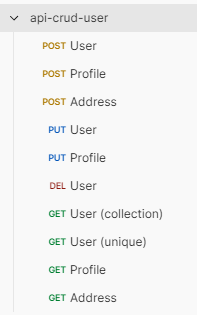

<h1 align="center">API CRUD Users</h1>

A User CRUD API built on Laravel 11.

<p align="center">		
		 
</p>

<p align="center">
	<a href="#computer-technology">Technology</a> •		
	<a href="#runner-starting">Starting</a> •
	<a href="#warning-prerequisites">Prerequisites</a> •
	<a href="#elephant-php-configuration">PHP configuration</a> •
	<a href="#hammer_and_wrench-installation">Installation</a> •	
	<a href="#construction_worker-author">Author</a> •
	<a href="#memo-license">License</a>
</p>

<p align="center">
	<kbd>
		
	</kbd>		
</p>

## :computer: Technology

-   [Laravel](https://laravel.com/)
-   [PHP](https://www.php.net/)

## :runner: Starting

These instructions will provide you with a copy of the project installed and running on your local machine.

## :warning: Prerequisites

What you need to install the application

```
PHP >= 8.2
Composer >= 2.8.11
```

### :elephant: PHP configuration

```
# Enable features in php.ini
extension=pdo_sqlite
```

## :hammer_and_wrench: Installation

Steps to run the application

```
# Clone
git clone https://github.com/tarcisioaraujo/api-crud-user.git

# Access the directory
cd api-crud-user

# Install and update Composer dependencies (takes a few minutes ☕)
composer install
composer update

# Set environment variables
cp .env.example .env

# Run PHP Server
php artisan serve

# Access address
http://localhost:8000/api/documentation
```

## :construction_worker: Author

<a href="https://github.com/tarcisioaraujo">
 
 <br />
 <sub><b>Tarcísio Silva de Araújo</b></sub></a> <a href="https://github.com/tarcisioaraujo" title="GitHub"></a>

Made by Tarcísio Silva de Araújo 👋

[](https://www.linkedin.com/in/tarcisiosaraujo/)
[](mailto:tarcisio.saraujo@gmail.com)

## :memo: License

This project is under license [MIT](./LICENSE).
